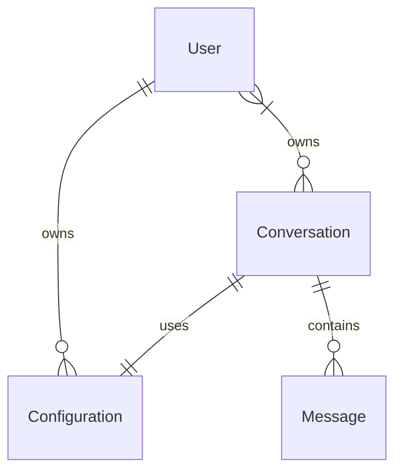

The Diagram below shows the current Relations between the Entities

```mermaid
erDiagram
User }|--o{ Conversation : owns
User ||--o{ Configuration : owns

Conversation ||--|| Configuration : uses
Conversation ||--o{ Message : contains

```
