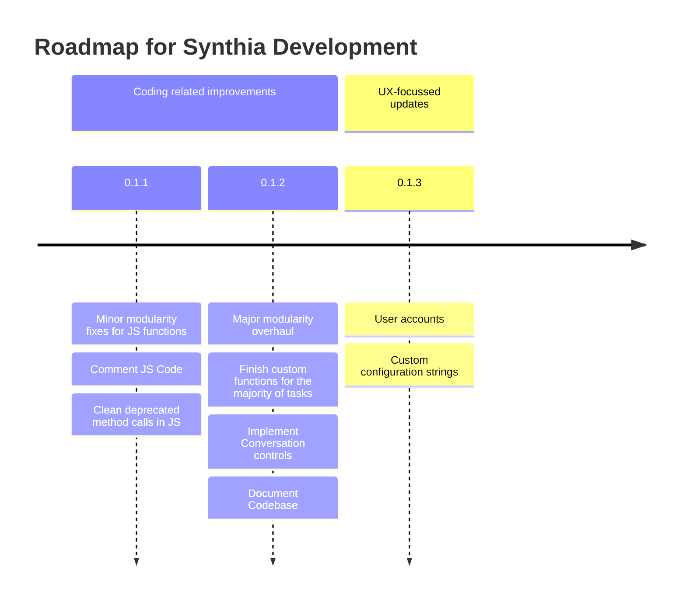

```mermaid
timeline
	title Roadmap for Synthia Development
	section Coding related improvements
	0.1.1 : Minor modularity fixes for JS functions
		  : Comment JS Code
		  : Clean deprecated method calls in JS

	0.1.2 : Major modularity overhaul
		  : Finish custom functions for the majority of tasks
	      : Implement Conversation controls
	      : Document Codebase

	section UX-focussed updates
	0.1.3 : User accounts
	      : Custom configuration strings
```
